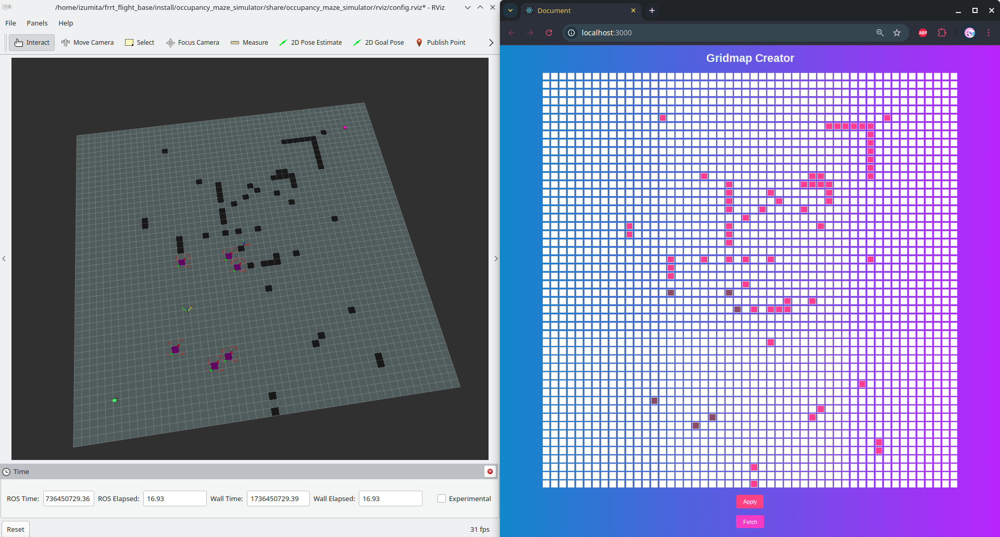
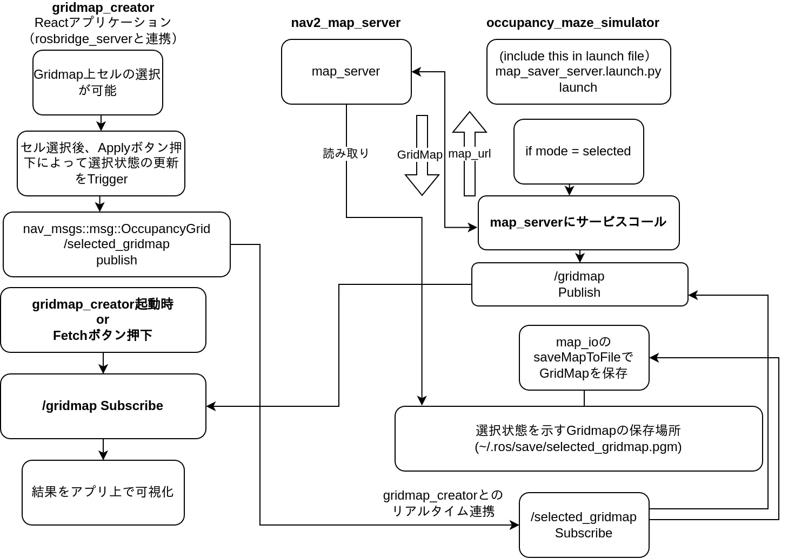

# Occupancy Maze Simulator

This package allows you to test your path planning node by providing a maze-based occupancy grid message and a simulated robot pose response. It includes random maze generation, start and goal positioning, and interactive feedback with Twist commands for movement.

## Example Usage

```bash
rviz2 -d occupancy_maze_simulator/rviz/config.rviz 

ros2 run occupancy_maze_simulator occupancy_maze_simulator_node \
--ros-args \
--param obstacle_mode:=maze \
--param gridmap.resolution:=1.0 \
--param gridmap.x:=50.0 \
--param gridmap.y:=50.0 \
--param start_position:=[2,2] \
--param goal_position:=[48,48] \
--param maze.density:=0.1
```

obstacle_mode: maze or random or select

## select modeの使い方

gridmap_creator という、Reactのウェブアプリケーションを使ってインタラクティブにGridMapを制作できます。
制作したGridMapは
```
~/.ros/save/selected_gridmap.yaml
~/.ros/save/selected_gridmap.pgm
```
として保存されますが、初回はここにGridMapが存在せずエラーになるため、
```
occupancy_maze_simulator/occupancy_maze_simulator/asset/saved_map/selected_gridmap.yaml
occupancy_maze_simulator/occupancy_maze_simulator/asset/saved_map/selected_gridmap.pgm
```
を
`~/.ros/save/`
以下にコピーしてください。

また、gridmap_creatorのディレクトリに行き、
```bash
npm install
```
でアプリケーションの起動準備をしてください。
(npmが入っていなければaptで入れましょう。 ->  sudo apt install npm)

その後、
```bash
ros2 launch occupancy_maze_simulator simulation_with_selected_gridmap_launch.py
```
で全てを起動できます。



### select modeのフローチャート



